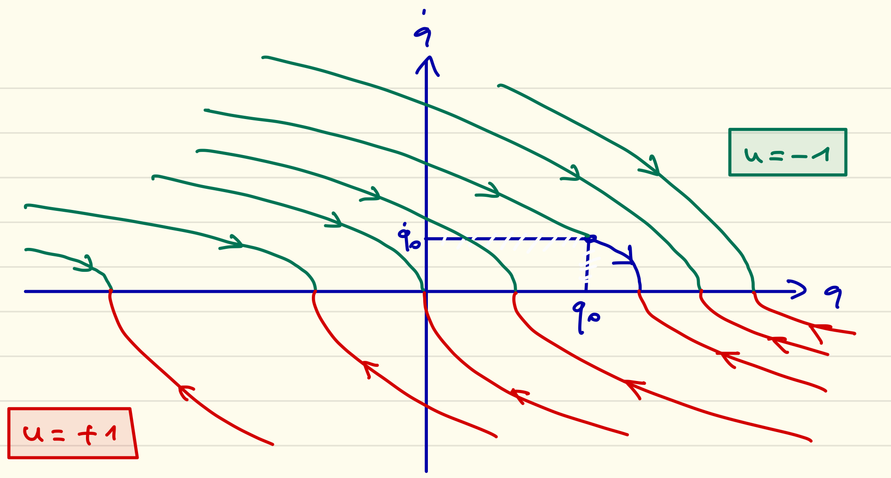

## MAM5-INUM
# Commande optimale
# 2023-24

# Exam CC no. 1

**Durée 2H00. Documents autorisés. Tous les exercices sont indépendants. Le barème prévisionnel est indiqué pour chaque exercice.**

## Exercice 1 (8 points)
Soit à résoudre le problème de temps minimum avec pour dynamique

$$ \ddot{q}(t)=u(t),\quad |u(t)| \leq 1, $$

et conditions aux limites

$$ q(0)=q_0,\quad \dot{q}(0)=\dot{q}_0,\quad \dot{q}(t_f)=0. $$

(Noter que $q(t_f)$ est libre.)

### 1.1
On pose $x(t)=(q(t),\dot{q}(t))$, mettre la dynamique sous la forme $\dot{x}(t)=f(x(t),u(t))$ avec $f$ une fonction que l'on précisera.

**Réponse.** $f(x,u) = (x_2,u)$

### 1.2
Écrire le hamiltonien du problème.

**Réponse.** $H(x,p,u) = p^0 + p_1 x_2 + p_2 u$

### 1.3
Écrire le système adjoint.

**Réponse.**

$$ \dot{p}_1 = 0,\quad \dot{p}_2 = -p_1 $$

### 1.4
Appliquer la condition de maximisation du PMP.

**Réponse.** $u = \text{sgn}(p_2)$ si $p_2 \neq 0$, $u$ quelconque sinon

### 1.5
Appliquer les conditions de transversalité.

**Réponse.** $p_1(t_f) = 0$

### 1.6
En déduire l'état adjoint.

**Réponse.** $p_1=0$ et $p_2=\text{cte}$

### 1.7
En déduire le contrôle optimal.

**Réponse.** Nécessairement $p_2$ est une cte non nulle (sinon $p^0=p_1=p_2=0$), donc $p_2$ a un signe (bien défini) et constant, de sorte que soit $u \equiv 1$, soit $u \equiv -1$ (contrôle constant, pas de commutation).

### 1.8
Déterminer le temps minimal en fonction des conditions initiales $(q_0,\dot{q}_0)$.

**Réponse.** La trajectoire est donc l'unique arc de parabole passant par $(q_0,\dot{q}_0)$ et intersectant la cible $\dot{q}=0$ (axe horizontal). On en déduit l'unicité de solution (l'existence étant admise) et la valeur du temps minimum en fonction des conditions initiales (fonction valeur du problème) en écrivant $\dot{q}(t) = u(t)+\dot{q}_0$ avec $u(t)=-\text{sgn}(\dot{q}_0)$ (le seul moyen d'atteindre la cible $\dot{q}(t_f) = 0$, équation qui donne $t_f$) : 

$$ t_f(q_0,\dot{q}_0) = |\dot{q}_0|. $$

### 1.9
Dessiner la synthèse dans le plan $(q,\dot{q})$.

**Réponse.**



## Exercice 2 (8 points)

Soit à résoudre le problème suivant ($t_f > 0$ est fixé) :

$$ \int_0^{t_f} u^4(t)\,\mathrm{d}t \to \min $$

avec pour dynamique

$$ \ddot{q}(t)=u(t),\quad u(t) \in \mathbf{R}, $$

et conditions aux limites

$$ q(0)=\dot{q}(0)=0,\quad q(t_f)=1. $$

(Noter que $\dot{q}(t_f)$ est libre.)

### 2.1
On pose $x(t)=(q(t),\dot{q}(t))$, mettre la dynamique sous la forme $\dot{x}(t)=f(x(t),u(t))$ avec $f$ une fonction que l'on précisera.

**Réponse.** $f(x,u) = (x_2,u)$

### 2.2
Écrire le hamiltonien du problème.

**Réponse.** $H(x,p,u) = p^0 u^4 + p_1 x_2 + p_2 u$

### 2.3
Écrire le système adjoint.

**Réponse.**

$$ \dot{p}_1 = 0,\quad \dot{p}_2 = -p_1 $$

### 2.4
Montrer que $p^0=0$ est impossible. (On posera par conséquent $p^0=-1$ dans la suite de l'exercice.)

**Réponse.** Si $p^0=0$, on a nécessairement $p_2$ identiquement nul (maximisation du hamiltonien sans contrainte sur $u$) ; or cela implique $p_1 = -\dot{p}_2$ également identiquement nul, *i.e.* $(p^0,p) = (0,0)$, ce qui est interdit.

### 2.5
Appliquer la condition de maximisation du PMP.

**Réponse.** $u = \sqrt[3]{p_2/4}$

### 2.6
Appliquer les conditions de transversalité.

**Réponse.** $p_2(t_f) = 0$

### 2.7
En déduire l'état adjoint.

**Réponse.** Comme $p_2$ est une fonction affine nulle en $t_f$, il existe un réel non nul $a$ tq $p_2(t) = a(t-t_f)$.

### 2.8
En déduire le contrôle optimal.

**Réponse.** $u(t) = \sqrt[3]{a(t-t_f)/4}$

### 2.9
En déduire finalement la trajectoire optimale $q(t)$, $t \in [0, t_f]$.

**Réponse.** Il existe un réel non nul $b$ tel que $\dot{q}(t) = b[(t-t_f)^{4/3} - t_f^{4/3}]$ et
$q(t) = b[(3/7)(t-t_f)^{7/3} - t_f^{4/3}(t-t_f)] + 1$ : la condition $q(0)=0$ impose $b =-7/(4t_f^{7/3})$.

## Exercice 3 (4 points)

### 3.1
Dans le problème de navigation, on applique le contrôle constant $u=-1$ entre $t$ et $t+2\pi$. Déterminer $x(t+2\pi)-x(t)$, $y(t+2\pi)-y(t)$ et $\theta(t+2\pi)-\theta(t)$.

**Réponse.** $x(t+2\pi)-x(t) = 2\pi w$, $y(t+2\pi)-y(t) = 0$ et $\theta(t+2\pi)-\theta(t) = -2\pi$.

### 3.2
Dans la portion de code ci-dessous, justifier la présence des termes `τ[1]*Δt`, `τ[2]*Δt`, `τ[3]*Δt` dans la discrétisation de la dynamique.

**Réponse.** Les produits par les `τ[i]` viennent des changements de variable (similitude) qui ramènent chacun des trois arcs sur $[0,1]$.

### 3.3
Comment modifier ce code si l'on ne suppose plus le contrôle constant par morceaux sur $[\tau_1,\tau_1+\tau_2]$ ?

**Réponse.** Il faut ajouter un vecteur d'inconnues `-1 ≤ u[1:3, 1:P] ≤ 1` et remplacer `u[1]` par `u[1, j]`, *etc.* dans le second membre de la contrainte `θ[1, j+1] = ...`, *etc.* (même chose pour les autres arcs).

### 3.4
Comment modifier ce code si l'on suppose le courant non plus constant et dirigé selon $(Ox)$ mais de direction quelconque et dépendant de l'état selon une fonction connue $(x,y) \mapsto (w_1(x,y), w_2(x,y)) \in \mathbf{R}^2$ ?

**Réponse.** Il faut remplacer `w` par `w1(x[1, j], y[1, j])` dans le second membre de la contrainte `x[1, j+1] = ...`, ajouter `w2(x[1, j], y[1, j])` dans le second membre de la contrainte `y[1, j+1] = ...`, *etc.* (même chose pour les autres arcs).

```julia
@variables(sys,begin
    x[1:3, 1:P]          
    y[1:3, 1:P]          
    θ[1:3, 1:P]          
    -1 ≤ u[1:3] ≤ 1       
     0 ≤ τ[1:3]           
    end)

for j in 1 : P-1
    @NLconstraints(sys, begin
        # x' = w + cos(theta)
        x[1, j+1] == x[1, j] + 0.5 * τ[1]*Δt * ( w + cos(θ[1, j]) + w + cos(θ[1, j+1]) )
        x[2, j+1] == x[2, j] + 0.5 * τ[2]*Δt * ( w + cos(θ[2, j]) + w + cos(θ[2, j+1]) )
        x[3, j+1] == x[3, j] + 0.5 * τ[3]*Δt * ( w + cos(θ[3, j]) + w + cos(θ[3, j+1]) )
        # y' = sin(theta) 
        y[1, j+1] == y[1, j] + 0.5 * τ[1]*Δt * ( sin(θ[1, j]) + sin(θ[1, j+1]) )
        y[2, j+1] == y[2, j] + 0.5 * τ[2]*Δt * ( sin(θ[2, j]) + sin(θ[2, j+1]) )
        y[3, j+1] == y[3, j] + 0.5 * τ[3]*Δt * ( sin(θ[3, j]) + sin(θ[3, j+1]) )
        # theta' = u
        θ[1, j+1] == θ[1, j] +       τ[1]*Δt * u[1]
        θ[2, j+1] == θ[2, j] +       τ[2]*Δt * u[2]
        θ[3, j+1] == θ[3, j] +       τ[3]*Δt * u[3]
    end)
end
```
